<!-- typing text -->

  

 

 

  <!-- Pac-Man Contribution Graph -->
  <picture>
    <source media="(prefers-color-scheme: dark)" srcset="./pacman-contribution-graph-dark.svg"/>
    <source media="(prefers-color-scheme: light)" srcset="./pacman-contribution-graph.svg"/>
    
  </picture>
  
   
  👾 Watch Pac-Man devour my contributions!

# 👋 About Me

I’m **Atharva Sharma**, a **Full Stack Developer** with strong focus on  
**frontend architecture and real-world usability**.

I don’t just make things *look good* —  
I make them **work well, scale properly, and stay maintainable**.

### What I care about:
- ⚙️ clean component architecture  
- 🎯 real user experience  
- 🚀 performance & responsiveness  
- 📦 production-ready code  

---

# 💻 Skills & Tools:
 <!-- Skills and Tools-->
---
<table align="center">
    <tr>
        <td style="font-weight: bold; padding-right: 10px; vertical-align: center; border: none;">
          
        </td>
        <td>
          
          
          
      
          
          
          
          
        </td>
    </tr>
    <tr>
        <td style="font-weight: bold; padding-right: 10px; vertical-align: center; border: none;">
          
        </td>
        <td>
          
          
          
      
          
          
        </td>
    </tr>
</table>

# 💻 Tech Stack:
                       
# 📊 GitHub Stats:
 
 

### ✍️ Random Dev Quote

### 🔝 Top Contributed Repo

---

<!-- Proudly created with GPRM ( https://gprm.itsvg.in ) -->
